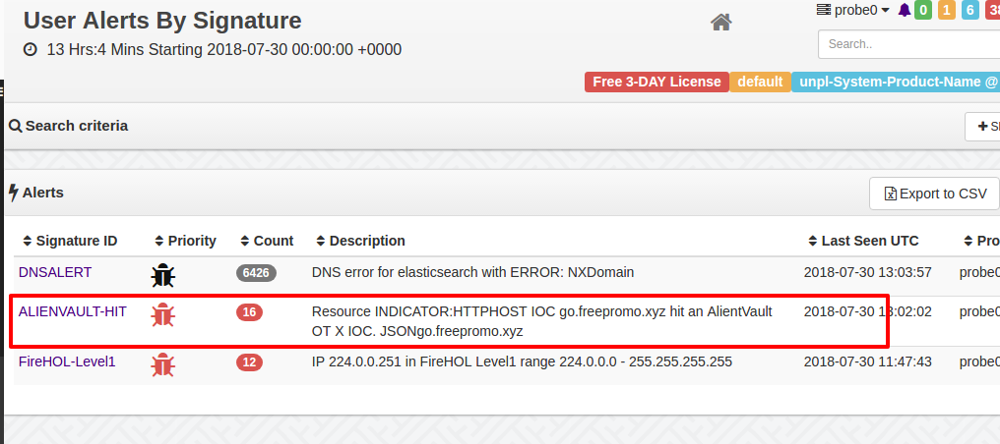

AlienVault OTX Intel Checker
============================


This simple LUA script checks about 14 Intel streams in your network traffic against the IOC found in AlientVault OTX.  

The IOCs from OTX are first compiled into a LevelDB database using a helper Ruby script `otx2leveldb.rb`

## The Trisul Intel Framework

Using the [IOC-Harvestor Trisul APP](https://github.com/trisulnsm/apps/tree/master/analyzers/ioc-harvestor) , we can create a new Resource Stream containing all potential IOC candidates in a single place.  The `check_intel.lua` script just checks each of them against a LevelDB database containing IOC information and generates an alert if
there is a hit.


## Getting the AlienVault OTX into a LevelDB database

The first thing you need to do is to get an AlienVault OTX API Key. Next, on OTX subscribe to any number of **Pulses** which are collections
of IOC items.  Finally run the otx2leveldb.rb script to download the IOC Pulses directly into a LevelDB for real time lookups.


Running otx2leveldb.rb, ( make sure you have installed the `leveldb` Ruby Gem)

````lua

$ gem install leveldb  
$
$ ruby otx2leveldb.rb 3843bca374..apikey    trisul-intel.level
88383 indicators saved.
$ 

````

## Connecting  the DB

The `check_leveldb.lua` Trisul script looks for the levelDB databases in `/usr/local/share/trisul-probe/plugins/` directory. Copy the
database into that directory and ensure it is readable by the default trisul user `trisul.trisul`

````bash

# cp trisul-intel.level /usr/local/share/trisul-probe/plugins/trisul-intel.level.0
# cp trisul-intel.level /usr/local/share/trisul-probe/plugins/trisul-intel.level.1
# chown -R trisul.trisul  /usr/local/share/trisul-probe/plugins/trisul-intel.level.* 

````

### Why two identical databases ?

You might be asking. Heeyy!  Wait a minute.  Why copy the same database twice. as .0 and .1 
The reason for that is there are two backend streaming pipeline threads in Trisul.  
They are different threads, by copying the two databases each thread loads its own and improves performance.

The levelDB rules are 

1. No two processes or threads can open a database more than once. There is a LOCK
2. Any number of threads can share a open LevelDB handle. So if you dont want to create two separate databases
 you can simply use `to_addr()` and pass the handle using the Message API of Trisul LUA scripting. 


## Running 

Just copy the `check-intel.lua` script into the Lua scripts directory and restart Trisul-Probe

````bash

# cp check-intel.lua /usr/local/var/lib/trisul-probe/domain0/probe0/context0/config/local-lua
# trisulctl_probe restart context default@probe0 

````

## Results

Thats it !! When Trisul gets an IOC hit on any of the 14 (hosts, file hashes, SSL Certs, domains, urls,..) you will get an alert
in the User-Alerts group as shown below


 


