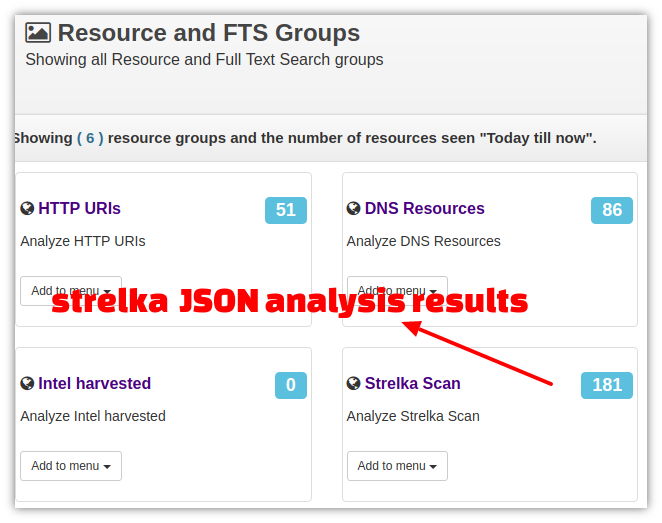
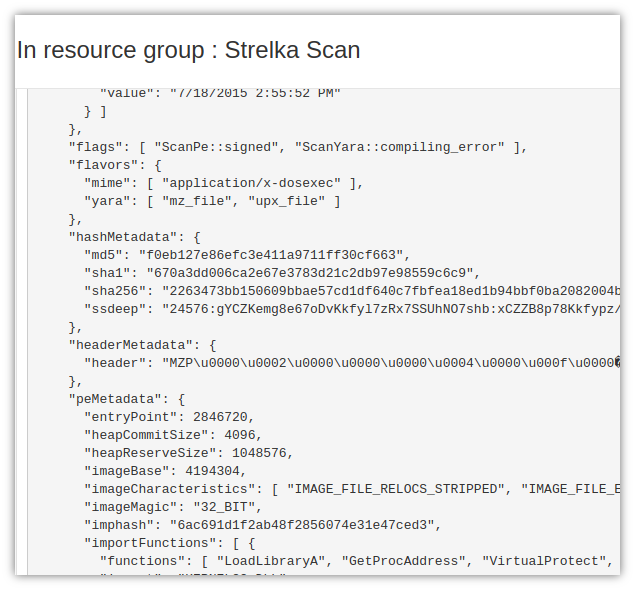

strelka
========

Strelka is a real time scalable file scanning framework. See  https://github.com/target/strelka

What we're trying to do here is to integrate Trisul NSM with Strelka 
  * Trisul extracts files from network into a directory
  * Strelka pulls files from that directory into a scanning cluster and puts results back in /var/log
  * The script here reads the JSON scan output and pushes it back into Trisul as new resource type (log) suitable for searching, alerting, metering etc.

## Running

First install [Trisul](https://www.trisul.org)   and [Strelka](https://github.com/target/strelka) 

  1. Install the [Save Binaries Trisul APP](https://github.com/trisulnsm/apps/tree/master/analyzers/save_binaries)  which extracts files from network into `/tmp/savedfiles` on Trisul-Probe nodes
  2. Edit  the `/opt/strelka/etc/dirstream/dirstream.yml` to watch the directory `/tmp/savedfiles` and to delete contents after scan. 
  ````
  workers:
      - directory:
	          directory: "/tmp/savedfiles"
			  source: null
			  delete_files: True

  ````
  3. Then follow the instructions on [strelka](https://github.com/target/strelka) to run the servers and dirstream
  ````
  # on trisul-probe (the client)
  /usr/local/bin/strelka_dirstream.py -d -c etc/dirstream/dirstream.yml
  # on the server
  /usr/local/bin/strelka
  ````
That ought to be enough to get started.  The results of the file scanning can be found in the JSON output files in `/var/log/strelka`


## the LUA scripts

Strelka dumps the scan results from the workers into /var/log/strelka.  The `strelka-json.lua` script tails these logs and pushes the JSON documents back into the Trisul streaming pipeline. You can then do alerting, further analysis, metrics on the strelka JSON. One example might be to alert if you trip a MMBOT malware prediction threshold. Get creative. 


## Using 

Once it is integrated and running, the Strelka Scan results will be sucked into Trisul Resources.  

### A new resource type Strelka Scan  

You can see a new resource type to hold the strelka JSON results.  This was created by the strelka-resource.lua script. Go to Resources > View All 




### Search / view scan results 

Clicking on Strelka Scan resource, will take you to the Resources Page. Here you can view , search, or download  the JSON prettified documents.

The following screenshot shows you JSON scan output of an EXE file




## TODO

There are many exciting improvements that can be done here. One of them is to link the scan results to the IP addresses that are involved. This can be done by modifying the filename to include the connection end points.  


