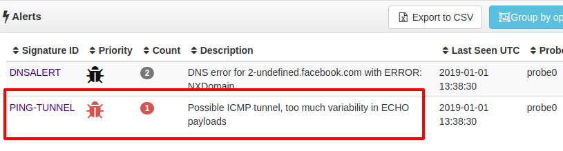

# ICMP Mega Tunnel Detector 

Nothing escapes the mega tunnel detector :-) 

There are two scripts in this directory. 

 1. icmp-echo-detect.lua  -  compares each ECHO with matching  ECHO-REPLY payload 
 2. hamming-check.lua - computes similarity of ECHO and REPLY payloads 


The other two lua files mrumap and sweepbuf are helpers. See section below 

## Installing

Copy all .lua files  into the Trisul-Probe LUA scripts directory at
`/usr/local/var/lib/trisul-probe/domain0/probe0/context0/config/local-lua` and then restart the probe.

## Using

Alerts will be fired into the "User Alerts"  alert type. 

Go to Alerts > Show All > User Alerts




## Development tips 

These are Trisul `simplecounter` [LUA scripts](https://www.trisul.org/docs/lua/simple_counter.html)  attached to the ICMP protocol. 

The following helper libs are used

 1. [BITMAUL](https://github.com/trisulnsm/bitmaul)  - the badass protocol dissection library , just 1 line of code per field !!
 2. [MRUMAP](https://github.com/trisulnsm/trisul-scripts/tree/master/lua/techniques/mrumap)  - the fast O(1) lookup table for icmp flow state. Old items (LRU) automatically drop off in O(1) 


## Hamming distance of normal vs tunnel packets  

This is what normal ICMP traffic looks like

````
hamming distance=3.6363636363636        size=5
hamming distance=5.4545454545455        size=5
hamming distance=3.6363636363636        size=5
hamming distance=5.4545454545455        size=5
hamming distance=3.6363636363636        size=5
hamming distance=3.6363636363636        size=5
hamming distance=5.4545454545455        size=5

````


This is what a PING Tunnel (using pTunnel looks like) 
````
hamming distance=87.725975261656        size=5
hamming distance=79.733587059943        size=5
hamming distance=97.050428163654        size=5
hamming distance=97.240723120837        size=5
hamming distance=97.145575642245        size=5
hamming distance=97.050428163654        size=5
hamming distance=96.669838249286        size=5
````


