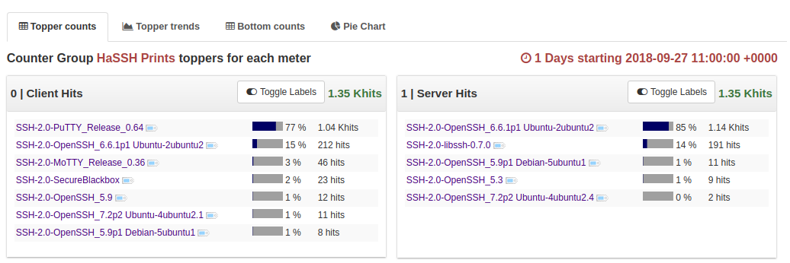

haSSH - SSH Hash implementation in TrisulNSM
============================================


An implementation of the "hassh" SSH fingerprinting introduced in this blog post [Open sourcing HASSH](https://engineering.salesforce.com/open-sourcing-hassh-abed3ae5044c ) 


## How it works?

We use the Trisul LUA API to decode the SSH2.0 protocol in a port-independent manner.   Then we add the following info into the Trisul streaming pipeline

1. Counters for Client and Server hassh
2. Labels for each hassh based on the SSL Version String 
3. Graph analytics edges to enable pivoting from hash -> IPs using them 

### The files

The main code is in `ssh-dissect.lua` in this snippet 

````lua

    local hashstr = table.concat(tbl.hshake.kex_algos,',') .. ';'..
        table.concat(tbl.hshake.encryption_algorithms_client_to_server,',')..';'..
        table.concat(tbl.hshake.mac_algorithms_client_to_server,',')..';'..
        table.concat(tbl.hshake.compression_algorithms_client_to_server,',')

    local haSSH = md5sum(hashstr)

    print( haSSH.." = ".. tbl.ssh_version_string)

    if tbl.role=="client" then
      pdur.engine:update_counter("{E49AA7D0-3DC8-46AC-E278-5DD07B298F0A}", 
                    haSSH, 0, 1); 

      pdur.engine:update_key_info("{E49AA7D0-3DC8-46AC-E278-5DD07B298F0A}", 
                    haSSH, tbl.ssh_version_string)
    else 
      pdur.engine:update_counter("{E49AA7D0-3DC8-46AC-E278-5DD07B298F0A}", 
                    haSSH, 1, 1); 

      pdur.engine:update_key_info("{E49AA7D0-3DC8-46AC-E278-5DD07B298F0A}", 
                    haSSH, tbl.ssh_version_string)

    end 

    pdur.engine:add_flow_edges("{E49AA7D0-3DC8-46AC-E278-5DD07B298F0A}", haSSH,  pdur.flowid) 
    

````


The other helper files  are

1. `sweepbuf.lua` and `pdurecord.lua` : From the [BITMAUL packet dissection](https://github.com/trisulnsm/bitmaul) helper library 
2. `hassh-counters.lua` : Defines the new counter group
3. `md5ffi` : FFI into libcrypto to calc MD5 
4. `ssh-spy.lua` : Port independent plugin to Trisul TCP Packet dissection 


## Running 

Put all these files in subdirectory under `/usr/local/var/lib/trisul-probe/domain0/probe0/context0/config/local-lua` and restart Trisul-Probe


### To view 

Go to Retro Counters > Select "haSSH Prints"


